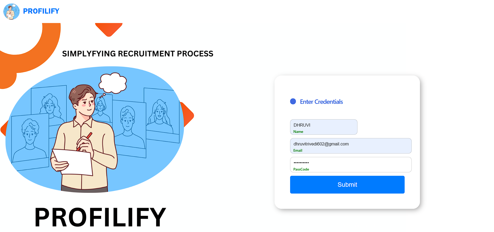
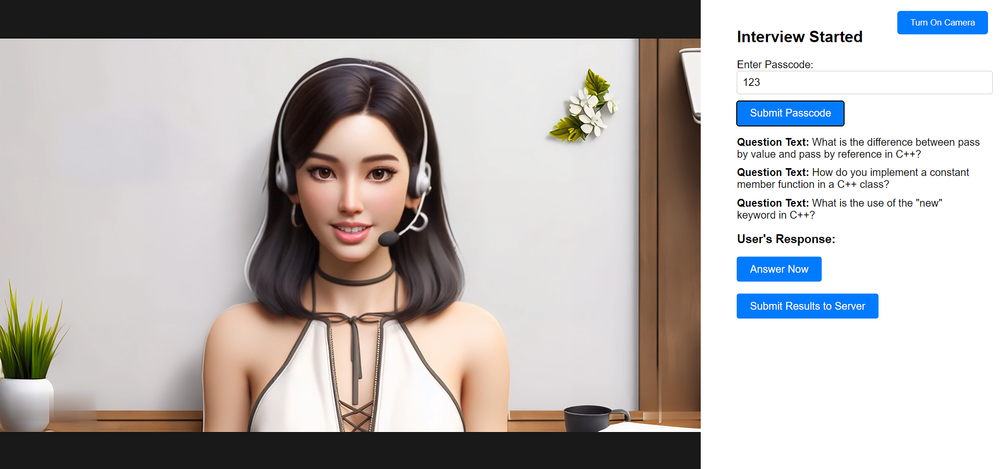
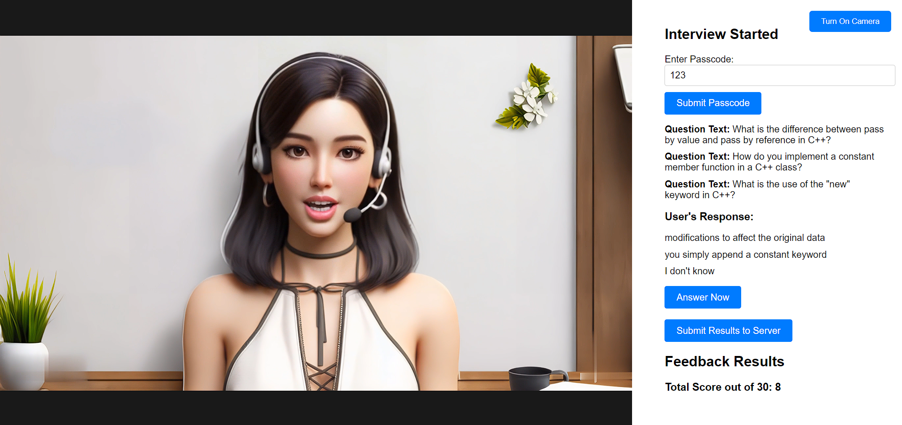

# AI Interviewer

HR recruitment processes are often labor-intensive and time-consuming. This project aims to alleviate these challenges by leveraging AI to assist both students seeking interview practice and companies looking to efficiently shortlist candidates.

## Features

- **Student Interface:** Allows students to select a preferred tech stack and practice interview questions.
- **Real-time Feedback:** Provides immediate feedback to students, aiding them in enhancing their skills effectively.
- **Company Interface:** Enables companies to schedule AI interviews, specifying the desired tech stack and number of questions.
- **AI-Avatar-Interview:** Utilizes AI avatars to conduct interviews, allowing for efficient candidate evaluation.

## Table of Contents
1. Motivation
2. Technologies Used
3. Installation
4. Screenshot
5. Credit

## Motivation

Traditional recruitment methods can be expensive and inaccessible, particularly for students and those on a budget. This project aims to democratize access to interview practice and streamline the hiring process for companies.

## Technologies Used
1. HTML/CSS/Javascript
2. Python
3. OpenAI API
4. MySQL
5. Text-To-Speech API
6. Speech-To-Text API


## Installation

1. Clone the repository:

   ```bash
   git clone https://github.com/602dhruviii/InterviewBot.git

## Screenshots and Visual Aids
### Login Page

### Choose Interviewer 

### Answer Questions

### View Your Results


## Credits
* **Project Lead**: *[Dhruvi Trivedi](https://github.com/602dhruviii)*
* **References**: 
  * React.js Documentation
  * Express.js Documentation
  * MySQL Documentation
  * OpenAI Documentation
  * ChatGPT


